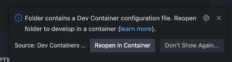
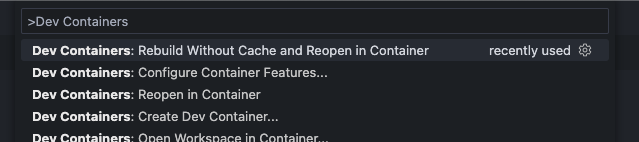

# VS Code Dev Containers: Node 18 + TypeScript 4.9

This is a demo project with the following features.

- Node 18 LTS
- TypeScript 4.9
- VS Code Dev Containers
- ESM with `"type": "module"`
- Run with `ts-node`
- Unit tests with `jest`

Shout out to [felipeplets/esm-examples](https://github.com/felipeplets/esm-examples) and [this StackOverflow answer](https://stackoverflow.com/a/65163089/) for guidance.

## Requirements

- [VS Code](https://code.visualstudio.com/)
- [Docker Desktop](https://www.docker.com/products/docker-desktop/)

## VS Code Extensions

- [Docker](https://marketplace.visualstudio.com/items?itemName=ms-azuretools.vscode-docker)
- [Dev Containers](https://marketplace.visualstudio.com/items?itemName=ms-vscode-remote.remote-containers)

## Opening a project with Dev Containers

When you open a project (like this one!) that uses Dev Containers you might see a pop-up like this one:

If you do not see this pop-up, you may not have the Dev Containers extension installed. You can still reopen the project with the command palette.

